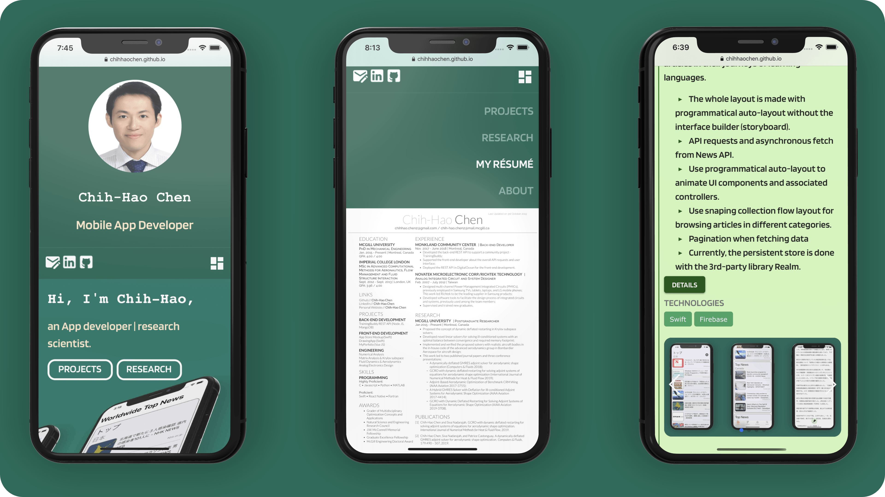

<h1 align="center">portfolioVue - Open Source Project for Portfolio Websites</h1>

<p align="center">
<a href="https://vuejs.org/"></a>

<a href="https://github.com/ChihHaoChen/portfolioVue/graphs/contributors"></a>
<a href="https://www.linkedin.com/in/chih-hao-chen-13583369/"></a>
</p>

<p align="center">

</p>


## About the project
This project is developed mainly with Vue.js. The generated HTML files are deployed under [my GitHub account](https://chihhaochen.github.io/). My initial purpose of building this website with JS is to separate the front-end development from the back-end database, so anyone can reuse my repository to build up their portfolio website by configuring their API calls and populating their back-end database.

> The database is in JSON format deployed in Firebase, while all the images and PDF files are stored in Amazon S3. Once the API data gets fetched, Vuex, a well-known framework for state management, is exploited to mutate the state variables associated with the database data. The Nuxt framework has been embedded in this repository for SPA (Single Page Application). Finally, as for the UI components, Vuetify is used for the material design of this portfolio side-project. This website is also compatible with popular browsers in mobile devices.


## Goals of this project
Although there are some good options about building one's own portfolio website, since I am gaining skills to be a developer, spending sometime on studying new technology for Web applications sounds fun to me. Also there is no better tool than doing a practical project when considering learning new programming languages. The other primary motivation to build this portfolio is to separate the frond-end development from the back-end database. Hopefully, with this approach, this project could be of some help to the junior developers who want to demonstrate their work to their potential employers. This portfolio covers four main aspects I'd like to present:

- Projects; 
- Research;
- Résumé;
- About.

### Projects
Inside this category, you can order your projects in either a chronological order or an inverse chronological order. Each project includes the descriptions in an array, the summary points, as well as the technology you've used for development. Each array item inside the descriptions will be a steadalone paragraph. There is a detail button that guides viewers to anther webpage for further details or the App store and the Google Play store if for mobile App. The least but the most important to include is the screenshots or the images that can be used to expalin your work. Videos can also be included in the carousel gallery by appending the video URL to the JSON database. Here is the JSON format for projects.

```yaml
"projects" : [ {
    "description" : [
      "Project0_description0",
      "Project0_description1"
    ],
    "detailLink" : "URL of the webpage that shows further details of your project",
    "end" : "Time of the end of the project0",
    "start" : "Time of the start of the project0",
    "summary" : {
      "header" : "currently not used, but it may be used to show the category of the project",
      "points" : [ {
        "text" : "Summary point0 of project0",
        "textid" : 0
      }, {
        "text" : "Summary point1 of project0",
        "textid" : 1
      }, {
        "text" : "Summary point2 of project0",
        "textid" : 2
      }, {
        "text" : "Summary point3 of project0",
        "textid" : 3
      }]
    },
    "technologies" : [ {
      "item" : "JavaScript"
    }, {
      "item" : "Swift"
      }, {
      "item" : "Object-C"
       }, {
      "item" : "Python"
    } ],
    "title" : "Your project title",
    "mediaItems": [{
      "src": "URL of the image0 of project0"
    }, {
      "src": "URL of the image1 of project0"
    }, {
      "src": "The link of the Youtube video for sharing it, for example, https://www.youtube.com/embed/j9I0PxhExQM",
      "videoUrl": "the last bit of the link, for example from the above case, j9I0PxhExQM"
    }],
    "id" : 0
  }, {
  	"description" : [
      "Project1_description0",
      "Project1_description1"
    ],
    "detailLink" : "URL of the webpage that shows further details of your project",
    "end" : "Time of the end of the project1",
    "start" : "Time of the start of the project1",
    "summary" : {
      "header" : "currently not used, but it may be used to show the category of the project",
      "points" : [ {
        "text" : "Summary point0 of project1",
        "textid" : 0
      }, {
        "text" : "Summary point1 of project1",
        "textid" : 1
      }, {
        "text" : "Summary point2 of project1",
        "textid" : 2
      }, {
        "text" : "Summary point3 of project1",
        "textid" : 3
      }]
    },
    "technologies" : [ {
      "item" : "Ruby"
    }, {
      "item" : "Python"
      }, {
      "item" : "Java"
    } ],
    "title" : "Your project title",
    "mediaItems": [{
      "src": "URL of the image0 of project1"
    }, {
      "src": "URL of the image1 of project1"
    }, {
      "src": "The link of the Youtube video for sharing it, for example, https://www.youtube.com/embed/j9I0PxhExQM",
      "videoUrl": "the last bit of the link, for example from the above case, j9I0PxhExQM"
    }],
    "id" : 1
 }]


```

### Research
If you do no need this research section, you can just remove it from the codebase too, and ignore this research section. However, if you do need this section. Please keep reading. Inside this category, you can also order your research topics in either a chronological order or an inverse chronological order. Similar to the project section, most of them are the same. The only difference lies in the detail button, and an additional PDF button if you'd like to share any publication in PDF format. Here is the JSON format for research.

```yaml
"publications" : [ {
    "description" : [
      "topic0_description0",
      "topic0_description1",
      "topic0_description2"
    ],
    "end" : "Time of the end of topic0",
    "pdfLink" : "PDF link associated with topic0",
    "start" : "Time of the start of topic0",
    "summary" : {
      "header" : "Category of topic0",
      "points" : [ {
        "text" : "Summary point0 of topic0",
        "textid" : 0
      }, {
        "text" : "Summary point1 of topic0",
        "textid" : 1
      }, {
        "text" : "Summary point2 of topic0",
        "textid" : 2
      }, {
        "text" : "Summary point3 of topic0",
        "textid" : 3
      }, {
        "text" : "Summary point4 of topic0",
        "textid" : 4
      } ]
    },
    "technologies" : [ {
      "item" : "Fortran"
    }, {
      "item" : "MPI"
    } ],
    "title" : "Title of topic0",
    "mediaItems": [{
      "src": "URL of the image0 of topic0"
    }, {
      "src": "URL of the image1 of topic0"
    }]
  }, {
    "description" : [
      "topic0_description0",
      "topic0_description1",
      "topic0_description2",
      "topic0_description3"
    ],
    "pdfLink" : "PDF link associated with topic1",
    "end" : "Time of the end of topic1",
    "detailLink" : "The URL link of the published paper assoicated with topic1",
    "start" : "Time of the start of topic1",
    "summary" : {
      "header" : "Category of topic1",
      "points" : [ {
        "text" : "Summary point0 of topic1",
        "textid" : 0
      }, {
        "text" : "Summary point0 of topic1",
        "textid" : 1
      }, {
        "text" : "Summary point0 of topic1",
        "textid" : 2
      } ]
    },
    "technologies" : [ {
      "item" : "C"
    }, {
      "item" : "PETSc"
    }, {
      "item" : "Python"
    } ],
    "title" : "Title of topic1",
    "mediaItems": [{
      "src": "URL of the image0 of topic1"
    }, {
      "src": "URL of the image1 of topic1"
    }, {
      "src": "URL of the image2 of topic1"
    }, {
      "src": "URL of the image3 of topic1"
    }]
  }

```
## Build Setup

``` bash
# install dependencies
$ npm run install

# serve with hot reload at localhost:3000
$ npm run dev

# build for production and launch server
$ npm run build
$ npm run start

# generate static project
$ npm run generate
```

For detailed explanation on how things work, checkout [Nuxt.js docs](https://nuxtjs.org).
